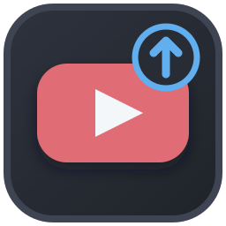

<p align="center"></p>
<h1 align="center">YouTube Private Uploader</h1>
<p align="center">Upload videos to your YouTube channel with a mandatory Private status.</p>
<p align="center"><a href="README.md">Русский</a> · <a href="https://github.com/Frommer-droid/Youtube-upload/releases/latest">Latest release</a></p>

The app selects the newest video in a working folder, assembles its title and description from editable templates, uploads it through YouTube Data API v3, and can add it to a playlist. Every uploaded video is **Private**. You can make it public only by changing its status manually in YouTube Studio.

## Features

- After you choose a working folder, select its newest video and a matching JPEG/PNG thumbnail. Matching video names, common cover names, and the older `Cover-G` name are supported; ambiguous covers require a manual choice.
- Edit title and description templates, enter a translator via `{translator}`, Telegram/MAX links and poem text, and preview the result.
- See upload progress and automatic retries for temporary network failures; set a thumbnail and optionally add the video to a playlist.
- Preserve form fields, templates, interface scale, and window position between launches.
- Keep entered fields when uploading another video; “Очистить название, перевод и ссылки” clears only the song name, translator, and Telegram/MAX links.
- Open the uploaded video or YouTube Studio from the result screen.

## Install and first upload

1. Download and run the installer from the [latest release](https://github.com/Frommer-droid/Youtube-upload/releases/latest). The packaged app does not require Python.
2. Create **your own** Desktop app OAuth client in Google Cloud, enable YouTube Data API v3, and download its JSON file. See [SETUP_GOOGLE.md](SETUP_GOOGLE.md) for the setup steps (in Russian) and links to Google's documentation.
3. Save it as `client_secret.json` in the installed app's `config` folder: `D:\Apps\YouTubePrivateUploader\config\client_secret.json` by default, or `C:\Apps\YouTubePrivateUploader\config\client_secret.json` when drive D is absent. The installer contains no credentials.
4. Choose a working folder containing a video and, optionally, a JPEG/PNG thumbnail. The app can open the current user's Desktop even when it has been moved. Enter a title, check the preview, and click “Загрузить на YouTube” (Upload to YouTube).
5. Complete authorization in your system browser on the first API request. After upload, open YouTube Studio if you want to change the Private status manually.

Playlist operations require the additional `youtube.force-ssl` OAuth scope. Google Cloud's Testing mode limits who can authorize the app and how long authorization lasts; the [setup guide](SETUP_GOOGLE.md) links to Google's current documentation.

## Run from source

You need Windows x64, Python 3.12, and your own `config\client_secret.json`. The build and noninteractive smoke test have been verified on Windows 11; Windows 10 has not been separately tested for this release.

```powershell
py -3.12 -m venv .venv
.\.venv\Scripts\python.exe -m pip install -r requirements.txt
.\.venv\Scripts\python.exe YouTubePrivateUploader.py
```

Tests and the reproducible build use the project environment:

```powershell
.\.venv\Scripts\python.exe -m pip install -r requirements-dev.txt
.\.venv\Scripts\python.exe -m pytest tests -q
.\.venv\Scripts\python.exe -m ruff check src tests Build_Tools --no-cache
powershell -NoProfile -ExecutionPolicy Bypass -File .\build.ps1
```

`build.ps1` restricts `PATH` to trusted runtime folders, audits the bundled DLLs, and runs a hidden noninteractive check of the frozen app. See [DEVELOPER.md](DEVELOPER.md) for build details.

## Data and limitations

- The OAuth client file lives beside the app. The token, settings, and personal templates live in `%APPDATA%\YouTubePrivateUploader\installations\<installation ID>\`. Each new installation starts with empty personal data; older files remain untouched. None of these files are in the repository or public installer.
- The app cannot switch a video to Public through the API and does not automate YouTube Studio.
- A real upload requires a working OAuth client, a YouTube channel, and API quota. Automated tests do not perform network uploads.

The owner's source code is available under the [MIT License](LICENSE). Third-party dependencies and the YouTube service have their own terms.
